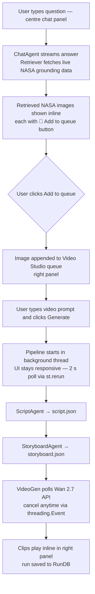

# [WILL.AI](http://willai-demo.duckdns.org/) — What Infinity Looks Like AI

> A multi-agent system that turns real NASA data into cinematic short films about the universe. Powered by Qwen models on Qwen Cloud, grounded by NASA's public APIs via MCP.

[](https://www.python.org/downloads/)
[](LICENSE)

<!--  -->

## What it does

**WILL.AI** (What Infinity Looks Like AI) is an autonomous multi-agent system with a three-panel Streamlit workbench. Type a natural language astronomy question and the bot pulls live NASA data to ground its answer; queue any retrieved image with a single click and the Video Studio runs the full pipeline (ScriptAgent → StoryboardAgent → Wan 2.7) in a background thread while you keep chatting.

The UI has three persistent panels:
- **Left — Conversations** — browse and resume past chat sessions
- **Centre — Chat** — multi-turn WILL.AI astronomy chatbot; retrieved NASA images shown inline with "📌 Add to queue" per image
- **Right — Video Studio** — image queue, video prompt, I2V / T2V mode selector, live pipeline status with a Cancel button, and inline clip playback

1. **Chat** — ask any astronomy question; the bot retrieves live NASA data and shows images inline
2. **Queue** — click "📌 Add to queue" on any retrieved image to send it to the Video Studio
3. **Generate** — type a prompt, click Generate; pipeline runs in the background and streams status every 2 s
4. **Watch** — one silent clip per queued NASA image plays inline in the right panel

Every frame is anchored to something real like terrain, weather, orbital context, which all gets assembled into a scene.

  

## System architecture

```
┌──────────────────────────────────────────────────────────────────────────────┐
│                          Streamlit Web UI  (3 panels)                        │
│  LEFT: Conversations   │   CENTRE: Chat (WILL.AI)    │  RIGHT: Video Studio  │
│  browse / resume past  │   multi-turn astronomy bot  │  image queue          │
│  conversations         │   live NASA data grounding  │  video prompt editor  │
│                        │   retrieved images + queue  │  pipeline status      │
│                        │   buttons inline            │  inline clip playback │
└────────────────────────┴──────────────┬──────────────┴────────────┬──────────┘
                                        │ chat message              │ Generate clicked
                          ┌─────────────▼───────────────┐   ┌────────▼──────────────────┐
                          │       ChatAgent             │   │   Orchestrator (threaded) │
                          │  Qwen 3.7-plus + Retriever  │   │   token-budget pipeline   │
                          │  → streamed answer tokens   │   └─────┬────────┬────────┬───┘
                          │  → chat_assets (images)     │         │        │        │
                          └─────────────────────────────┘         ▼        ▼        ▼
                                                            DataAgent  ScriptAgent  StoryboardAgent
                                                            nasa-mcp   scene caps   visual prompts
                                                            tools      per image    + ref frames
                                                                                         │
                                                                          ┌──────────────▼──────────────┐
                                                                          │  VideoGen (Wan 2.7 i2v/t2v) │
                                                                          │  async HTTP poll, cancel    │
                                                                          │  support via threading.Event│
                                                                          │  one ~10 s clip per scene   │
                                                                          └─────────────────────────────┘

All LLM calls      → Qwen Cloud (DashScope API)
Video generation   → Wan 2.7 on Qwen Cloud (async poll, background thread in app)
MCP server         → local subprocess or Alibaba Cloud ECS
Streamlit UI       → local dev (uv run streamlit run app.py)
```

## Pipeline Flowchart



## NASA MCP server — data backbone

The `nasa_mcp/` directory contains a [Model Context Protocol](https://modelcontextprotocol.io) server that exposes NASA's public APIs as typed tool calls. The Orchestrator agent uses these tools to pull real astronomical data into the pipeline.

### Available tools

| Tool | What it provides |
|------|-----------------|
| `get_apod_tool` | Astronomy Picture of the Day for any date back to 1995 |
| `search_apod_tool` | Full-text search across the APOD archive |
| `get_neo_feed_tool` | Near-Earth asteroids and close approach data for a date range |
| `get_neo_lookup_tool` | Detailed orbital data for a specific asteroid |
| `search_image_library_tool` | Search 140,000+ images and videos in the NASA Image Library |
| `get_image_asset_tool` | All size variants and metadata for a specific NASA image asset |
| `search_exoplanets_tool` | Query NASA's Exoplanet Archive (5,000+ confirmed planets) |
| `get_exoplanet_stats_tool` | Summary statistics for the confirmed exoplanet catalog |
| `get_epic_images_tool` | Full-disc Earth photos from DSCOVR's EPIC camera |
| `get_epic_available_dates_tool` | List all dates with EPIC Earth imagery available |
| `get_cme_events_tool` | Coronal mass ejection events from DONKI |
| `get_flr_events_tool` | Solar flare events from DONKI |
| `get_gst_events_tool` | Geomagnetic storm events from DONKI |

### Scene reconstruction sources (planned)

These are the next NASA data sources to wire into the pipeline so a scene can be reconstructed from real terrain, weather, and event context instead of generic prompts.

| Source | What it adds to a reconstructed scene |
|------|---------------------------------------|
| Mars Trek WMTS | Mars terrain, landing-site mosaics, elevation, and camera framing context for believable surface shots |
| EONET | Curated Earth natural events such as storms, fires, dust outbreaks, and cyclones with linked imagery and metadata |
| InSight Mars Weather | Wind, pressure, and temperature measurements from the Martian surface for accurate local conditions |

### MCP server design

- **Feature-first modules** — each NASA API domain lives under `nasa_mcp/features/<feature>/`, with API client, Pydantic input schemas, MCP tool registration, and tests co-located.
- **SQLite cache with TTLs** — immutable data (APOD entries) cached indefinitely; time-sensitive data (NEO feeds) cached 24h. Zero infrastructure required.
- **Pydantic-typed tool schemas** — every tool input is a validated schema surfaced to Qwen for accurate tool selection.
- **stdio transport** — runs as a subprocess of the MCP client; deployable as a long-running Alibaba Cloud Function Compute instance.

## Qwen Cloud integration

| Component | Qwen Cloud service |
|---|---|
| Orchestrator + all agents | Qwen LLM (chat API, tool-calling mode) |
| Video generation | Wan / HappyHorse endpoint on Qwen Cloud |
| MCP server hosting | Alibaba Cloud ECS / Function Compute |
| Asset caching | Alibaba Cloud OSS (production) / SQLite (local dev) |

## Video generation: model fallback chain

Wan/HappyHorse free-tier quota is granted per **exact model string**, not per model family — a dated snapshot (`wan2.7-i2v-2026-04-25`) and its bare alias (`wan2.7-i2v`) draw from *separate* quota pools, and some bare aliases carry **no free quota at all** (pure pay-as-you-go from the very first call). `agent/video_gen.py` handles this with two ordered fallback lists instead of one hardcoded model per mode.

**How it works:** `I2V_MODEL_PRIORITY` and `T2V_MODEL_PRIORITY` are tried in order. On quota exhaustion — or any other submission failure — for one model, the next candidate is tried automatically. The I2V chain only falls through to the T2V chain once every I2V candidate has failed, and if every model in *both* chains fails, the run raises a real error rather than silently falling back to an unlimited pay-as-you-go model. The bare `wan2.7-i2v` / `wan2.7-t2v` aliases are deliberately excluded from both lists for exactly this reason — and left off the DashScope API key's model allow-list entirely, so it's structurally impossible for the app to bill against them.

| Priority | I2V / R2V | T2V |
|---|---|---|
| 1 | `wan2.7-i2v-2026-04-25` *(default)* | `wan2.7-t2v-2026-06-12` *(default)* |
| 2 | `wan2.1-i2v-plus` | `wan2.7-t2v-2026-04-25` |
| 3 | `wan2.1-i2v-turbo` | `wan2.6-t2v` |
| 4 | `wan2.7-r2v-2026-06-12` *(silent, single-reference use only)* | `wan2.2-t2v-plus` |
| 5 | `happyhorse-1.1-i2v` | `wan2.5-t2v-preview` |
| 6 | `happyhorse-1.0-i2v` | `wan2.1-t2v-plus` |
| 7 | `happyhorse-1.1-r2v` | `happyhorse-1.1-t2v` |
| 8 | `happyhorse-1.0-r2v` | `wan2.1-t2v-turbo` *(last resort)* |

Every model above has a request schema verified with real API calls via `test_video_models.py`, not assumed from a naming pattern — several early assumptions (e.g. `wan2.1-i2v-plus`'s reference-image field name, HappyHorse's minimum clip duration) turned out wrong and were only caught by actually calling them.

**Known limitations:**
- Clip length isn't fully consistent under deep fallback — `wan2.1-i2v-plus`/`wan2.1-i2v-turbo` cap at 5s (a hard model limit), and several T2V fallbacks default to ~5s since they don't have a confirmed `duration` parameter, versus the app's normal 10s target.
- R2V models support multi-reference and voice-cloning input; this app deliberately only ever sends one silent reference image, to match its no-dialogue motion-directive prompting.
- A few free-quota models (`wan2.6-i2v`, `wan2.2-i2v-plus`, `wan2.5-i2v-preview`, `wan2.6-r2v`, `kf2v-plus`, etc.) aren't in the chain yet — added only once a genuine DashScope-sourced schema example confirms how to call them.

## Live demo

The app is deployed on Alibaba Cloud ECS (US Virginia):

- **URL:** http://willai-demo.duckdns.org
- **Server:** `47.85.190.101` — ecs.e-c1m1.large, 2 vCPU, 2 GB RAM, Ubuntu 22.04
- **Stack:** Streamlit served via nginx reverse proxy on port 80

### Enable HTTPS (optional)

To remove the "Not secure" browser warning, add a free Let's Encrypt certificate:

```bash
# On the ECS server
apt install -y certbot python3-certbot-nginx
certbot --nginx -d willai-demo.duckdns.org
```

Also open port **443** in the Alibaba Cloud security group (TCP, `443/443`, `0.0.0.0/0`).  
The URL then becomes **https://willai-demo.duckdns.org** with a valid certificate.

## Getting started

### Prerequisites

- Python 3.12+
- [`uv`](https://docs.astral.sh/uv/)
- [NASA API key](https://api.nasa.gov) (free, instant)
- Qwen Cloud API key (sign up at [qwencloud.com](https://www.qwencloud.com))

### Install

```bash
git clone https://github.com/manvocao0271/nasa-mcp-assisted-ai-video-generation
cd nasa-mcp-assisted-ai-video-generation
uv sync
```

### Configure

```bash
cp .env.example .env
# Set NASA_API_KEY and QWEN_API_KEY in .env
```

### Launch the UI

```bash
uv run streamlit run app.py
```

Open `http://localhost:8501`. Type any request into the chat box, e.g.:

- *"Get me any photo taken on Mars and generate a 10-second video of what it is like on Mars"*
- *"Reconstruct a windy day on Mars using Mars Trek terrain and InSight weather data"*
- *"Show me what happened in space on the day I was born — July 14, 1998"*
- *"Make a short film about the next asteroid passing close to Earth"*
- *"Generate a video about an exoplanet similar to Earth"*
- *"Turn a DONKI solar storm or an EONET wildfire into a dramatic science scene"*

After NASA data is fetched you pick which images to use as visual references. Each subsequent agent step streams a status update to the UI. The generated clip plays inline when complete. NASA images used are shown in the sidebar source panel.

### Run tests

```bash
uv run pytest                          # unit + integration (no network)
uv run pytest -m live                  # live NASA API round-trips (needs NASA_API_KEY)
```

To verify a Wan/HappyHorse video model's request schema and output before adding it to the fallback chain, `test_video_models.py` submits a real minimal request using the same production code path:

```bash
python test_video_models.py --models wan2.6-i2v
python test_video_models.py --all       # everything not already confirmed
```

## UI layout notes

When the Video Studio panel is open the app switches to a locked-viewport mode so neither the chat nor the studio panel causes the browser page to scroll.

### How page-scroll locking works

Streamlit's DOM structure (as of Streamlit 1.x) does **not** expose a `[data-testid="stMain"]` element. The actual scroll containers are:

| Element | Role |
|---|---|
| `[data-testid="stApp"]` | Root app wrapper |
| `[data-testid="stAppViewContainer"]` | Main viewport container — this is what the browser scrolls |
| `[data-testid="stMainBlockContainer"]` | Block layout container — can grow taller than viewport |

When the studio opens, `pages/chat.py` injects a persistent `<style id="_will_scroll_lock">` into `<head>` via `components.html` + `window.parent.document`:

```css
html, body,
[data-testid="stApp"],
[data-testid="stAppViewContainer"],
[data-testid="stMainBlockContainer"] {
  overflow: hidden !important;
  max-height: 100vh !important;
  padding-bottom: 0 !important;
}
```

**Why `<head>` injection instead of `st.markdown()`?** Streamlit's emotion CSS engine re-applies React component styles on every re-render, overwriting inline `style.setProperty` calls and even `st.markdown` `<style>` blocks in `<body>`. A `<style>` tag appended to `<head>` survives React re-renders because React only reconciles its own mounted subtree inside `<body>`.

**Why `padding-bottom: 0`?** Streamlit adds bottom padding to `stMainBlockContainer` equal to the height of the floating input bar (~73 px) so content is not hidden behind it. This extra padding makes the block container taller than the viewport, triggering a scrollbar. Zeroing it out keeps the total height at exactly `100vh`.

### Chat column layout (`[1, 6, 0.5]` inner columns)

Inside the 11-unit chat column, content is placed in a three-column shim `[1, 6, 0.5]` with `gap=None`. The blank outer columns act as padding that cannot be overridden by emotion CSS (unlike `padding` CSS on column elements):

- **Left pad (1 unit)** — aligns bot avatar with input bar left edge
- **Content (6 units)** — all messages and media
- **Right pad (0.5 units)** — breathing room between content and chat scrollbar

The input bar padding is derived from the same column ratios so left/right edges align exactly:

```
padding-left:  calc((100vw - 300px) * 0.0772 + 2rem)
padding-right: calc((100vw - 300px) * 0.4596 + 1rem)
```


## Project structure

```
app.py                  # Streamlit UI (wide layout): left panel = chat + queue buttons; right panel = Video Studio (queue, prompt, pipeline, clips)
agent/                  # Multi-agent pipeline
  orchestrator.py       # Token-budget-aware pipeline driver
  data_agent.py         # Calls nasa-mcp tools → output/assets.json
  script_agent.py       # Scene captions (1 per selected image) → output/script.json
  storyboard_agent.py   # Visual prompts + NASA ref frames → output/storyboard.json
  video_gen.py          # Wan 2.7 API client (Qwen Cloud) → output/clips/
  qwen_client.py        # OpenAI-compatible Qwen Cloud chat client
nasa_mcp/               # NASA MCP server (data backbone)
  features/
    apod/               # Astronomy Picture of the Day
    donki/              # DONKI space-weather events (CME, flare, geomagnetic storm)
    earth/              # EPIC satellite imagery
    neo/                # Near-Earth Objects
    exoplanets/         # Exoplanet Archive
    image_library/      # NASA Image & Video Library
    mars_trek/          # Mars Trek WMTS (scaffold — not registered yet)
  cache.py              # SQLite TTL cache
  config.py             # Config / env loading
  server.py             # MCP server entry point
output/                 # Generated artifacts (gitignored)
  assets.json            # NASA data fetched for the request
  script.json            # Scene captions (structured JSON, silent video)
  storyboard.json        # Per-scene visual prompts
  clips/                 # Generated scene mp4(s)
  episode_manifest.json  # Run summary: data sources, token spend, clip paths
tests/                   # Integration tests
test_video_models.py     # Standalone schema/output verification for Wan/HappyHorse models
```

## Retrieval-Augmented Generation (RAG)

**Goal:** Ground chat responses in real NASA data and reduce LLM hallucinations by retrieving and citing relevant artifacts.

### Phase 1 — Simple RAG ✅ Implemented

`agent/retriever.py` is a lightweight retriever that reuses `DataAgent` to fetch and summarise NASA tool outputs for a query. `ChatAgent` calls it before each LLM turn, injecting the top-K passages as grounding context with source citations. No external vector-store dependencies required.

### Phase 2 — Embeddings + Vector Store (planned)

- Add `agent/embeddings.py` (Qwen embeddings or `sentence-transformers`) and `agent/vector_store.py` (Chroma or FAISS).
- Add `scripts/index_artifacts.py` to embed `output/*.json` artifacts into the vector store.
- Query flow: embed user query → nearest-neighbour search → top-K passages injected into LLM prompt.

```bash
# Phase 2 dependencies
pip install chromadb sentence-transformers
```

### Phase 3 — UI & infra (planned)

- Display retrieved source snippets inline with assistant replies in the chat panel.
- Add a background indexer that keeps the vector store in sync with new `output/` runs.

### Agent roles

| Agent | Responsibility | Key outputs |
|---|---|---|
| **Orchestrator** | Drives the pipeline, enforces token budget, writes run manifest | `episode_manifest.json` |
| **ChatAgent** | Multi-turn astronomy chatbot with live NASA data grounding via Retriever | streamed answer + `chat_assets` |
| **Data Agent** | Calls NASA MCP tools, selects best raw assets for a theme | `assets.json` |
| **Script Agent** | One short visual caption per selected NASA image | `script.json` |
| **Storyboard Agent** | One Wan visual prompt per scene, each locked to its reference frame | `storyboard.json` |
| **VideoGen** | One silent clip per storyboard entry via Wan 2.7 on Qwen Cloud | `clips/scene_N.mp4` |

### Data sources

| NASA source | What it provides |
|---|---|
| `get_apod_tool` | Astronomy Picture of the Day back to 1995 |
| `search_apod_tool` | Full-text search across the APOD archive |
| `get_neo_feed_tool` / `get_neo_lookup_tool` | Near-Earth asteroid close-approach data |
| `search_image_library_tool` / `get_image_asset_tool` | 140,000+ NASA images and videos |
| `search_exoplanets_tool` / `get_exoplanet_stats_tool` | NASA Exoplanet Archive (5,000+ confirmed planets) |
| `get_epic_images_tool` / `get_epic_available_dates_tool` | Full-disc Earth photos from DSCOVR EPIC |
| `get_cme_events_tool` / `get_flr_events_tool` / `get_gst_events_tool` | DONKI space-weather events |
| Mars Trek WMTS *(planned)* | Mars terrain mosaics and elevation data |
| EONET *(planned)* | Earth natural events (storms, fires, dust outbreaks) |
| InSight Mars Weather *(planned)* | Wind, pressure, and temperature from the Martian surface |

## License

MIT — see [`LICENSE`](LICENSE).